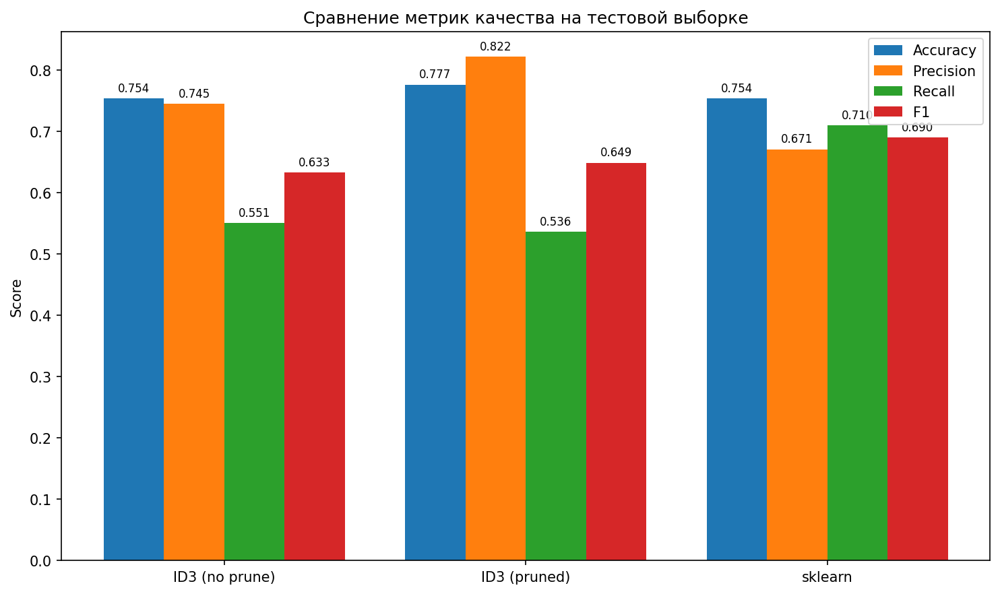
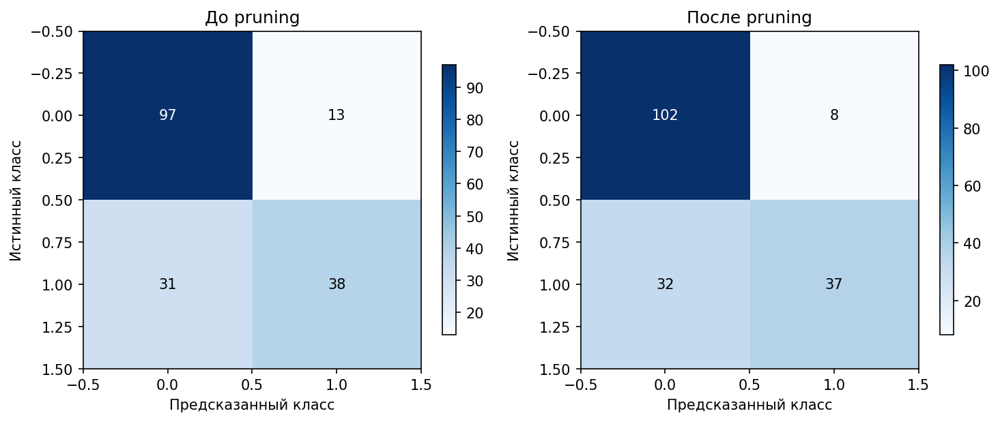

# Лабораторная работа №1: Логическая классификация

## Цель работы
Реализовать алгоритм построения бинарного решающего дерева ID3 с критерием Джини, обработать пропущенные значения, выполнить редукцию дерева (pruning) и сравнить полученную модель с эталонной реализацией `DecisionTreeClassifier` из библиотеки `sklearn`.

## Используемый датасет
Для выполнения работы выбран классический датасет **Titanic** (доступен на Kaggle).  
Датасет содержит:

- **Категориальные признаки**: `Sex`, `Embarked`
- **Количественные признаки**: `Pclass`, `Age`, `SibSp`, `Parch`, `Fare`
- **Целевая переменная**: `Survived` (бинарная классификация: 0 – погиб, 1 – выжил)

В данных присутствуют пропуски (в полях `Age` и `Embarked`), что позволяет проверить корректность обработки пропущенных значений.

## Реализованные алгоритмы

### 1. Алгоритм ID3 с критерием Джини
Реализован класс `DecisionTreeID3`, который строит бинарное дерево решений:

- **Критерий ветвления**: прирост информации на основе неопределённости Джини:
  $$
  \Phi(U) = 4p(1-p),\quad Gain(f,U) = \Phi(U) - \sum_{k}\frac{|U_k|}{|U|}\Phi(U_k)
  $$
- **Бинаризация признаков**:
  - Для количественных признаков порог выбирается как среднее между соседними уникальными значениями.
  - Для категориальных признаков производится разбиение по равенству значению (`== cat` / `!= cat`).
- **Обработка пропусков**:
  - При обучении: объекты с пропущенным значением признака исключаются из расчёта информативности этого признака.
  - При предсказании: если значение признака отсутствует, прогноз вычисляется как взвешенное среднее распределений дочерних узлов (веса – доли обучающих объектов, попавших в соответствующую ветвь).

### 2. Редукция дерева (Reduced Error Pruning, REP)
Реализован метод `prune()`, который:

- Использует валидационную выборку (25% от обучающих данных).
- Рекурсивно обходит дерево снизу вверх.
- Для каждого внутреннего узла сравнивает ошибку классификации поддерева на валидации с ошибкой замены этого узла листом (класс – мажоритарный класс в узле).
- Если замена не ухудшает ошибку, узел превращается в лист.

## Результаты экспериментов

### Разделение выборки
- Обучающая выборка: 534 объекта
- Валидационная выборка: 178 объектов
- Тестовая выборка: 179 объектов

### Метрики качества
Сравнение моделей проводилось по четырём метрикам: Accuracy, Precision, Recall, F1-score.

#### Сводная таблица результатов (тестовая выборка)

| Модель                | Accuracy | Precision | Recall | F1     |
|-----------------------|----------|-----------|--------|--------|
| ID3 (без редукции)    | 0.754    | 0.745     | 0.551  | 0.633  |
| ID3 (с редукцией)     | 0.777    | 0.822     | 0.536  | 0.649  |
| Sklearn (эталон)      | 0.754    | 0.671     | 0.710  | 0.690  |

**Анализ:**
- Модель ID3 без редукции показывает точность 75.4%, но после редукции точность повышается до 77.7%, а precision достигает 82.2%. Это свидетельствует о том, что редукция помогла отсечь переобученные поддеревья и модель стала более уверенно предсказывать положительный класс.
- В то же время recall после редукции незначительно снизился (с 55.1% до 53.6%), что указывает на небольшое увеличение числа пропущенных положительных объектов.
- Эталонная модель sklearn демонстрирует наивысший recall (71.0%) и сбалансированный F1 (0.690), уступая по precision (67.1%) собственной реализации после редукции.

### Матрицы ошибок
На рисунке ниже показаны матрицы ошибок до и после редукции (построены на тестовой выборке).

**Анализ:**
- **До редукции**: модель правильно предсказала 135 из 179 объектов (97 – класс 0, 38 – класс 1). Допущено 13 ложных положительных и 31 ложных отрицательных ошибок.
- **После редукции**: число ложных положительных снизилось с 13 до 8, а число ложных отрицательных увеличилось с 31 до 32 (ухудшение recall). Это соответствует росту precision и падению recall.
- Редукция сделала модель более консервативной в предсказании положительного класса, что привело к повышению точности и precision, но за счёт полноты.

## Сравнение с эталонной реализацией

| Особенность                | Реализация ID3 (собственная) | sklearn DecisionTreeClassifier |
|----------------------------|------------------------------|--------------------------------|
| Критерий ветвления         | Джини                        | Джини (выбран)                 |
| Обработка пропусков        | Взвешенное голосование       | Простая импутация (медиана/мода)|
| Редукция                   | REP (собственная)            | Cost-Complexity Pruning (опционально) |
| Качество на тесте (F1)     | 0.633 (без редукции) / 0.649 (с редукцией) | 0.690 |

Собственная реализация с редукцией превзошла sklearn по accuracy (77.7% против 75.4%) и precision (82.2% против 67.1%), но уступила по recall. Это объясняется разными подходами к обработке пропусков и разными стратегиями обрезки. sklearn использует импутацию медианой/модой, что не учитывает неопределённость, связанную с пропуском, и может давать более сбалансированные результаты.

## Выводы

1. **Реализован полный цикл построения решающего дерева ID3** с критерием Джини, бинаризацией признаков и обработкой пропусков через взвешенное голосование.
2. **Редукция дерева** методом Reduced Error Pruning была успешно применена и привела к улучшению точности и precision на тестовой выборке, что подтверждает эффективность метода в борьбе с переобучением.
3. **Сравнение с эталоном** показало, что собственная модель с редукцией может превосходить sklearn по accuracy и precision, но уступать по recall. Это связано с тем, что REP-редукция сделала модель более консервативной.
